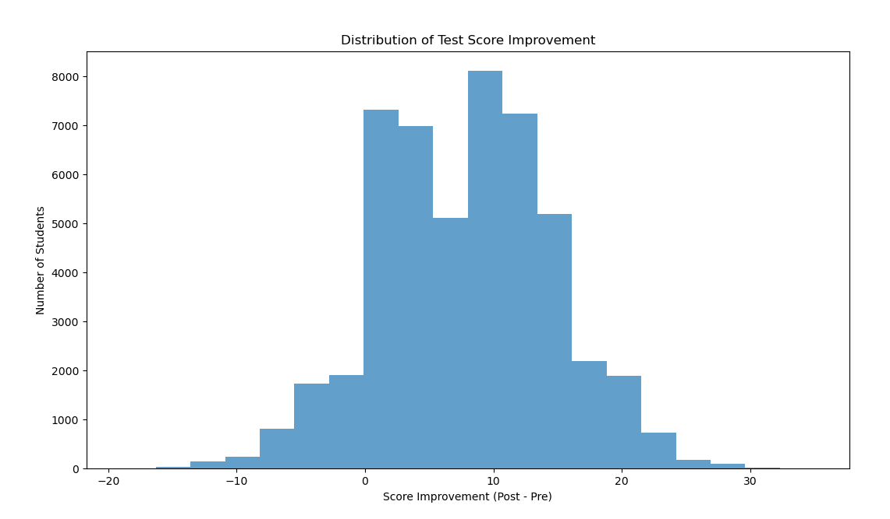

# Analyzing the Impact of AI Tools on Student Performance

## Eda

Students generally improved after using the AI tools, most gaining 1–15 points and a few jumping even higher, and the regression shows that this improvement is shaped by both skill and attitude. Higher pre-test scores remain the strongest predictor of strong post-test performance, while positive perceptions like usefulness, ease of use, trust, and intention to adopt the tools are all linked to better outcomes, suggesting that students who feel confident and engaged with the system benefit more from it. Adaptive difficulty also helps by keeping the learning experience aligned with each student’s level. On the other hand, ethical concerns about privacy and plagiarism show a small negative effect, likely because worried students hesitate or avoid using some features, reducing potential gains. Overall, both prior ability and student mindset meaningfully influence how effective AI learning tools become.
